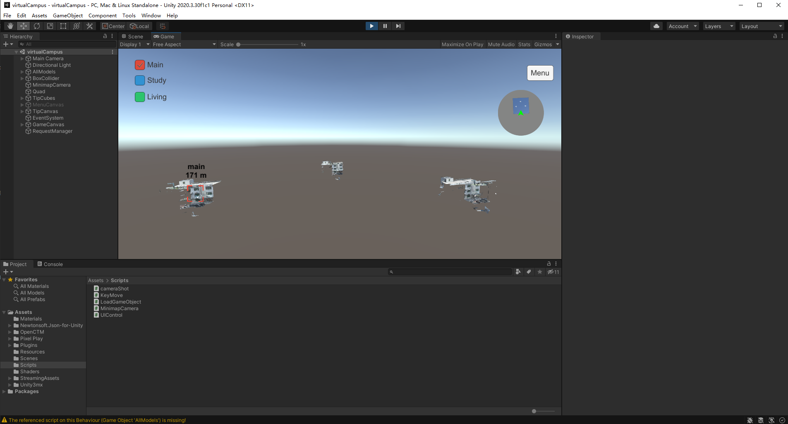
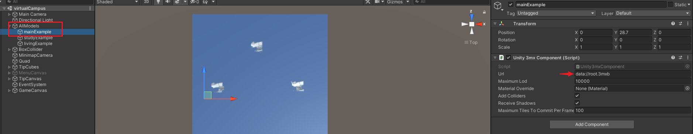
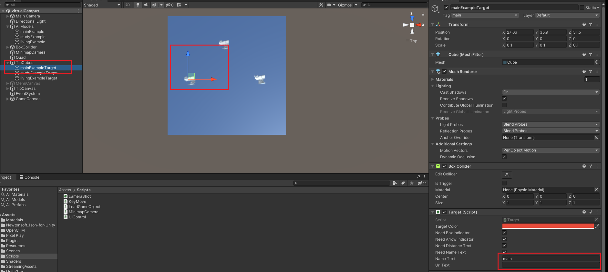
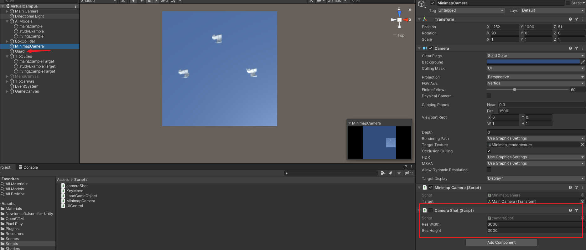

# virtualCampus

Unity3d项目：虚拟校园。示例代码运行效果如下：

用自己模型替换后，效果如下:

演示视频:[我用无人机和Unity3D为【东南大学】做了虚拟校园系统_哔哩哔哩_bilibili](https://www.bilibili.com/video/BV1wZ4y1673U)

## 已验证平台
- PC(Win) Standalone
- WebGL

## 开发环境
- Windows 10
- Unity2020.3.30f1c1

## 如何使用

- 导入自己的模型:

  - 在这里添加模型，并填入路径（本地文件路径或网址）:

    

  - 在这里添加作为目标的方块，并填入名字和跳转网址：

    

- 改变小地图:

  运行后利用截图脚本截图，并把截图替换到Quad中：

  

## 开源轮子
- [Unity-3mx](https://github.com/ProjSEED/Unity-3mx)
- [off-screen-indicator](https://github.com/jinincarnate/off-screen-indicator)

#### 希望项目对你有帮助！如果可能，送我被咖啡吧～

	

