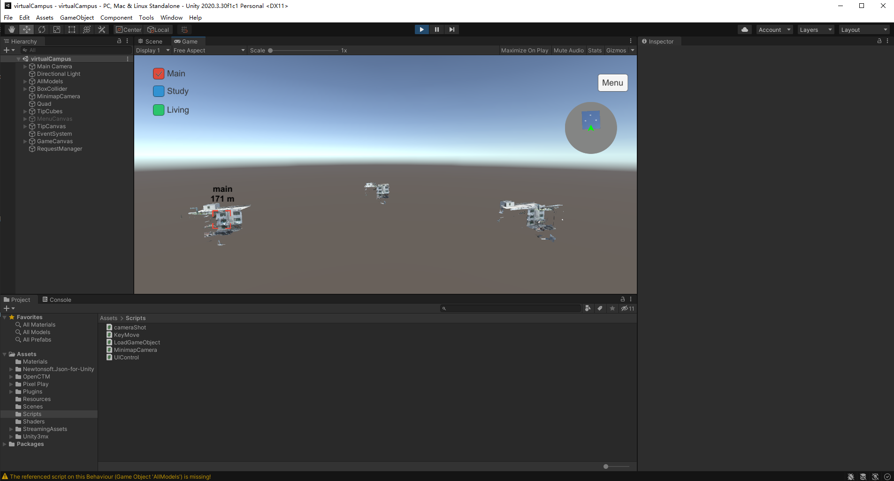
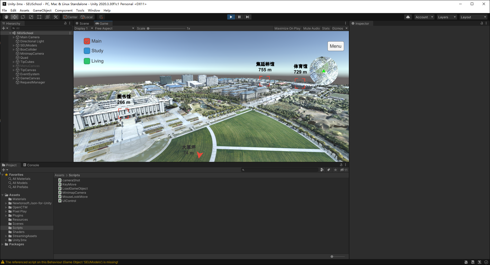
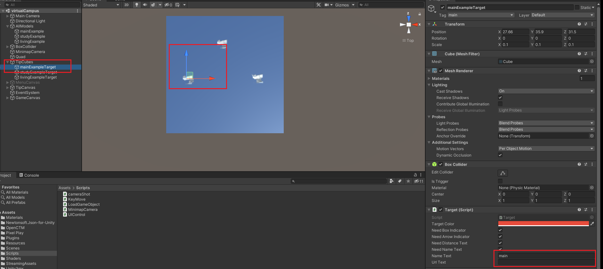
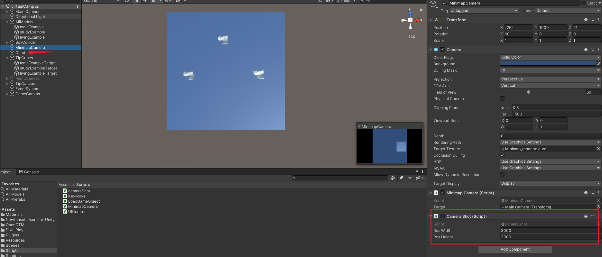

# virtualCampus

[中文](./Doc/README-CN.md)

Virtual Campus unity3d project. Open and run it, u can get:

Replace your own school models, u can get:

Example video:[我用无人机和Unity3D为【东南大学】做了虚拟校园系统_哔哩哔哩_bilibili](https://www.bilibili.com/video/BV1wZ4y1673U)

## Tested platform

- PC(Win) Standalone
- WebGL

## Tested dev env
- Windows 10
- Unity2020.3.30f1c1

## How to Use
- Import your own models:

  - Add model and fill your own path(file or url):

    

  - Add target cube and fill the name and url:

    

- Change Minimap:

  Enable camera shot script and take a shot. Replace the shot in Quad.

  

## Thirdparty
- [Unity-3mx](https://github.com/ProjSEED/Unity-3mx)
- [off-screen-indicator](https://github.com/jinincarnate/off-screen-indicator)

Hope this project helps u, buy me a coffee if u can.
{:height="100px" width="100px"}
